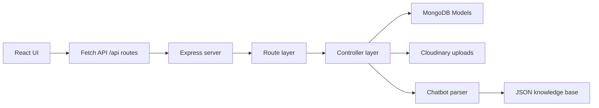

```markdown
# Ondrivo — Industrial Process & Systems Engineering Platform

A full-stack industrial software platform combining a public-facing website, an authenticated admin dashboard, MongoDB-backed content management, and a lightweight AI-style chatbot. Built for laboratories, manufacturing plants, and process industries — not generic websites.

This project demonstrates engineering discipline at the intersection of chemistry and code: clean route structure, reusable backend utilities, optimized frontend rendering, and a deliberate balance between maintainability and performance — all tailored for industrial applications.

---

## Project snapshot

Ondrivo is a full-stack industrial software platform built to serve both public-facing marketing needs for an engineering firm and internal content workflows. It combines a polished React frontend with a Node/Express API, MongoDB persistence, Cloudinary media processing, and a lightweight AI-style chatbot that answers recurring industrial and laboratory questions from structured JSON data.

### Core goals

- create a strong engineering brand website showcasing industrial software capabilities
- allow admins to manage blogs, projects, testimonials, and case studies without exposing sensitive admin logic publicly
- keep the site fast by optimizing media and reducing unnecessary re-renders
- design the backend so that common error handling, validation, and API flow are reusable instead of duplicated
- show a clear engineering architecture that is understandable to developers and industrial clients reviewing the project

### What makes it portfolio-worthy

- production-style backend structure with route separation and shared utilities
- frontend optimization patterns used intentionally, not as decoration
- real database-backed workflows instead of static mock content
- content management functions tied to actual persistence and media uploads
- a developer-friendly codebase that emphasizes maintainability, scalability, and performance
- unique positioning at the intersection of industrial chemistry and software engineering

---

## Why this project exists

Ondrivo is more than a landing page. It is a small production-style application with multiple concerns:

- marketing pages for LIMS, Process Dashboards, custom industrial software, and company proof
- content management workflows for admin users
- cloud-based media handling for images
- a real API layer with protected routes
- a simple chatbot that answers recurring industrial and laboratory questions using local structured data

The architecture favors clarity, predictable data flow, and low-friction extension. It was intentionally structured so that a developer can trace a feature from the browser to the database without digging through unrelated layers.

---

## Tech stack

- React + Vite for the frontend
- Node.js + Express for the backend API
- MongoDB + Mongoose for data persistence
- Cloudinary for image hosting and optimization
- Cookie-based authentication for protected admin routes
- JSON-driven chatbot knowledge base for lightweight intent matching

---

## Architecture overview



This project separates the system into clear layers:

1. UI layer: pages, cards, forms, lists
2. API layer: route registration and request handling
3. Business logic: controllers and validation
4. Data layer: models and MongoDB access
5. Utility layer: shared helper code for error handling, uploads, and response parsing

That separation is intentional and keeps the codebase maintainable as it grows.

---

## File structure and design choices

```text
Ondrivo/
├── client/
│   ├── src/
│   │   ├── App.jsx
│   │   ├── Components/
│   │   └── ...
│   ├── vite.config.js
│   └── package.json
├── server/
│   ├── config/
│   ├── controllers/
│   ├── data/
│   ├── middleware/
│   ├── models/
│   ├── routes/
│   ├── utils/
│   ├── server.js
│   └── package.json
├── package.json
├── README.md
└── ...
```

### Why this layout works

- Routes stay focused on API definitions instead of business logic.
- Controllers handle application behavior without being cluttered by repeated validation boilerplate.
- Model files define schema and persistence rules centrally.
- Utility files reduce duplication across the server.
- Frontend components are split by responsibility: landing pages, dashboard management pages, shared layout, and route-level pages.

This is a clean feature-oriented architecture for a project of this size.

---

## Data flow through the application

### 1. Public content requests

The public pages fetch data from endpoints such as:

- /api/blogs
- /api/projects
- /api/testimonials
- /api/case-studies

Example flow:

1. The React page mounts.
2. A useEffect hook fires.
3. The page calls fetch('/api/blogs').
4. Express receives the request.
5. The route delegates to the matching controller.
6. The controller queries MongoDB via the relevant model.
7. The backend returns JSON.
8. The frontend stores it in state.
9. The component filters, slices, and renders it.

This pattern is used across the site to keep frontend pages lightweight and data-driven.

### 2. Admin content creation flow

Admin actions involve more moving parts:

1. The admin form submits a multipart FormData payload.
2. The route receives the request with file + metadata.
3. The controller validates incoming values.
4. The selected image is uploaded to Cloudinary.
5. The uploaded URL is saved into the database document.
6. The server responds with the created or updated record.
7. The dashboard refreshes the list and re-renders the UI.

This design keeps the database clean and avoids storing enormous local files or bulky base64 strings in MongoDB.

### 3. Authentication flow

Protected admin features use cookies and auth middleware.

The login route creates or verifies identity, then stores a session-style cookie. Future requests to protected endpoints include that cookie, and the middleware checks whether the user is authorized before the controller actually runs.

This keeps admin logic guarded without polluting route logic with repeated manual checks.

---

## Server architecture and why route order matters

The server file is deliberately ordered in a specific sequence:

1. environment setup and imports
2. CORS and cookie middleware
3. static file serving
4. public routes
5. protected routes
6. catch-all routing
7. 404 handling
8. global error handler
9. database connection and app startup

This ordering matters because Express handles requests in a top-down sequence. If a broad catch-all or static route runs before API routes, it can intercept traffic that should have been processed by a controller.

The app therefore keeps API paths earlier and the catch-all later, which makes route resolution deterministic and avoids accidental shadowing.

### Public vs protected routes

Public routes include:

- auth routes
- reset routes
- blogs
- projects
- testimonials
- case studies
- chatbot

Protected routes include:

- dashboard routes
- admin content management actions

This separation makes the app clearer for both users and developers. There is a strong boundary between browsing content and modifying it.

---

## Why the database connection happens before requests are accepted

In the backend startup flow, the app does not start listening immediately. It waits for the MongoDB connection to resolve first.

```js
connectDB().then(() => {
  app.listen(PORT, () => {
    console.log(`Backend running on http://localhost:${PORT}`);
  });
});
```

This is a critical production-quality decision.

If the server were to listen before MongoDB was ready:

- requests would fail unpredictably
- controllers would hit uninitialized data sources
- logs would be noisy and harder to interpret
- startup behavior would be fragile in development and production

By connecting first, the app ensures the application is only serving traffic when its core dependency is ready. This is a standard and reliable startup pattern for backend systems.

---

## Why the Vite proxy was used

The frontend runs on a different port than the API, so browser CORS would block direct calls unless the app used a proxy.

In Vite, this is configured in the client config:

```js
server: {
  proxy: {
    '/api': {
      target: 'http://localhost:5000',
      changeOrigin: true,
      secure: false,
    },
  },
}
```

### Why this is beneficial

- the frontend can still call /api paths without hardcoded hostnames
- CORS is avoided in development
- all API requests behave as if they are local to the app
- the codebase stays cleaner and easier to port

This is a practical developer experience improvement that reduces unnecessary configuration complexity.

---

## Why trust proxy is enabled

The application sets:

```js
app.set('trust proxy', 1);
```

This tells Express to trust the first proxy in front of it. This matters when requests pass through a reverse proxy or an upstream loader before reaching the Node server.

The reason this matters here is that the app relies on secure cookie behavior and headers that can be altered by proxies. Without this setting, request metadata and forwarded values may be misinterpreted, and secure session behavior can become less reliable.

In a real deployment, this makes the app safer and more correct when running behind proxy infrastructure.

---

## Centralized error handling

One of the strongest engineering decisions in the backend is the centralized error layer in the utility file.

```js
const asyncHandler = (fn) => (req, res, next) => {
  Promise.resolve(fn(req, res, next)).catch(next);
};

const errorHandler = (err, req, res, next) => {
  const status = err.status || 500;
  const message = err.message || 'Server error';
  res.status(status).json({ message });
};
```

### Why this is important

Without this pattern, every controller would need repeated try/catch blocks and custom status handling. That would create duplication and inconsistencies, and it would make the server harder to maintain.

With the shared utility:

- controller code stays concise
- all API errors follow a consistent response format
- status codes remain coherent across routes
- route handlers focus on business logic instead of boilerplate error management

The long-term benefit is maintainability. It reduces line count, improves readability, and keeps behavior predictable across all APIs.

---

## Controller pattern and reduced code duplication

Controllers in this project consistently use the shared helper pattern rather than manual error wrapping.

Example:

```js
exports.getBlogs = asyncHandler(async (req, res) => {
  const blogs = await Blog.find().sort({ createdAt: -1 });
  res.json(blogs);
});
```

This approach reduces repetitive code significantly. Instead of writing multiple nested try/catch blocks for every route, the controller remains focused on its actual task: validate input, query the model, and respond.

This is why the server stays compact and legible even with several content modules such as blogs, projects, testimonials, and case studies.

---

## Chatbot data flow and JSON-driven intelligence

The chatbot is built around a local knowledge base rather than a large external AI model. The flow is intentionally lightweight and transparent.

### Request flow

1. User submits a message from the frontend.
2. Frontend calls /api/chatbot.
3. Controller pass the message to parseAndReply().
4. The parser reads chatbotknowledgebase.json.
5. It extracts meaningful keywords from the message.
6. It compares those keywords with each intent in the JSON data.
7. It scores the closest matching intent.
8. It adds contextual replies where relevant.
9. It returns a final response.

### Parser structure

The parser is designed around a simple but effective pipeline:

- readKnowledgeBase(): loads the JSON file from disk
- extractKeywords(): removes common filler words and keeps useful terms
- scoreIntents(): compares the user message to the knowledge base intent keywords
- extractContext(): checks for context-rich responses based on message content
- buildResponse(): combines the best match and any context into a final answer

```js
const parseAndReply = (message) => {
  const data = readKnowledgeBase();
  const intents = data.intents || [];
  const keywords = extractKeywords(message);
  const matches = scoreIntents(keywords, intents);

  if (matches.length === 0 || matches[0].score === 0) {
    const defaultIntent = intents.find(i => i.id === 'default');
    return defaultIntent ? defaultIntent.reply : "I'm not sure how to respond.";
  }

  const bestMatch = matches[0];
  const contextReplies = extractContext(message, bestMatch);
  return buildResponse(bestMatch, contextReplies);
};
```

### Why this design was chosen

This is a practical and deliberate compromise:

- no large AI dependency required
- easy extensibility through a JSON file
- content edits do not require code changes
- response logic stays readable and maintainable
- the tool is useful for FAQs about LIMS, process dashboards, and industrial services

It is a great example of a lightweight, developer-friendly, content-driven chatbot architecture for a portfolio project.

---

## Asset optimization strategy

### Cloudinary-based image optimization

Images are uploaded through Cloudinary with transformation settings such as:

```js
transformation: [
  {
    width: 800,
    height: 800,
    crop: 'limit',
    quality: 'auto',
    fetch_format: 'auto'
  }
]
```

This provides multiple gains:

- image size is reduced before delivery
- the browser receives optimized formats when possible
- resizing prevents large images from dominating page weight
- the app avoids heavy local media storage

This is a high-value optimization because visual media often has the largest impact on page weight.

### Lazy image loading

The app uses the native browser lazy-loading approach for images in content cards:

```jsx

```

This prevents offscreen images from loading immediately, which helps initial page rendering feel faster, particularly on content-heavy sections such as blogs and projects.

### List pagination and partial rendering

Components such as Blogs and Projects do not render all records at once. Instead, they keep a visibleCount state and display only a limited number of items, with a load more action.

This reduces initial rendering cost and keeps the page responsive even when the backend returns many records.

---

## Frontend performance optimization patterns

This project uses several React patterns intentionally to reduce wasted renders and improve perceived performance.

### The primary optimized components

The key performance-aware components include:

- Blogs.jsx
- Projects.jsx
- Proof.jsx
- BlogManage.jsx
- ProjectManage.jsx
- CaseStudyManage.jsx
- TestimonialManage.jsx
- ProjectDetail.jsx
- Contact.jsx

These sections are list-heavy and data-driven, so reducing unnecessary rendering is especially important.

### useMemo

useMemo is used for values that are recomputed from existing state, especially filters and paginated slices.

Examples:

- filtered blog list
- visible project list
- derived values like detail fields on project pages

This avoids recomputing large arrays on every re-render.

### useCallback

useCallback is used for functions passed into child components or invoked frequently in effect cycles.

Examples:

- fetch functions
- search handlers
- date filter handlers
- loadMore actions
- form submit handlers
- delete and edit actions

This stabilizes function references and helps avoid unnecessary child re-renders.

### memo

memo is used around reusable display components such as cards and empty/loading states.

```jsx
const BlogCard = memo(({ blog }) => (
  <div className="blog-card">...</div>
));
```

This ensures that unchanged cards do not rerender when unrelated state changes occur.

### useReducer

useReducer is used where multiple related values are updated together. This is especially effective for admin dashboard forms and list state management.

This pattern centralizes transitions like:

- form field updates
- form reset behavior
- preview state
- visible count adjustments
- delete confirmation state
- edit/create mode switching

It keeps state changes more controlled and easier to reason about than many independent useState calls.

---

## Why these patterns reduce JSX length and improve clarity

The project uses a set of compact, declarative patterns instead of verbose repeated code blocks.

### Arrow functions

Arrow functions shorten handler definitions and make inline event logic more readable.

### Ternary operators

The app uses concise conditionals for route redirects and UI state selection, such as:

```jsx
isAuthenticated ? <Dashboard /> : <Navigate to="/admin" replace />
```

This avoids a long if/else tree inside JSX.

### Object lookup patterns

Fields and reducer action types are mapped through object-driven patterns rather than large switch-like condition blocks. This is cleaner and more scalable.

### Derived values and memoized arrays

Instead of writing repeated filter logic inline across multiple render cycles, the app stores derived values once and recalculates only when dependencies change.

The net effect is that JSX files do not become bloated with repetition. The code remains modular, compact, and easier to maintain while still being explicit enough for a developer to follow.

---

## Why object-driven patterns were chosen

A recurring decision in this project is to avoid unnecessary branching and repeated logic.

Examples:

- reducer actions are organized by type
- form metadata is stored in arrays and rendered with map()
- data fields are iterated with Object.entries() when preparing FormData payloads

This pattern reduces repetitive code and makes it easy to add fields later. It also keeps the code aligned with modern React patterns used in maintainable, scalable frontends.

---

## Dashboard optimization and state control

The admin modules are designed for content-heavy management screens. They use combined state and memoization to keep the UI smooth even while editing or uploading media.

The dashboard management screens use patterns such as:

- memoized card rendering
- local visibleCount for pagination
- reducer-managed form state
- controlled preview rendering for uploaded images
- lazy card visibility with IntersectionObserver

This combination reduces UI jank and allows the dashboard to behave well even with a fair amount of content.

---

## Security and reliability choices

The project includes a few important engineering safeguards:

- protected routes for admin features
- cookie-based session control
- validation before database writes
- standard HTTP status codes for failed operations
- consistent error reporting across the API
- Cloudinary for media handling instead of local server storage

These are not just nice-to-haves; they make the application safer and easier to reason about in real-world use.

### IntersectionObserver usage in the UI

The app uses the browser's `IntersectionObserver` to progressively reveal cards as they enter the viewport. This pattern is used in the dashboard management screens and other content-heavy sections, including the blog, project, and case study lists.

Example implementation:

```js
useEffect(() => {
  const observer = new IntersectionObserver(
    (entries) => {
      entries.forEach(entry => {
        if (entry.isIntersecting) entry.target.classList.add('visible');
      });
    },
    { threshold: 0.1, rootMargin: '50px' }
  );

  const cards = document.querySelectorAll('.blog-card');
  cards.forEach(card => observer.observe(card));

  return () => observer.disconnect();
}, [state.blogs]);
```

Why this is useful:

- it improves perceived performance by animating or revealing cards only when needed
- it reduces visual clutter on large list pages
- it avoids forcing all cards to be visible and interactive at once
- it makes the dashboard feel lighter and less overwhelming for the user

This is a user-experience optimization rather than a security feature, but it reinforces the project's performance-first frontend design.

### Ownership-based authorization and security model

The app enforces authorization at the server layer using JWT-based authentication and ownership checks in the database queries.

The middleware reads the token from either the Authorization header or the cookie:

```js
const decoded = jwt.verify(token, process.env.JWT_SECRET);
req.user = { id: decoded.id, email: decoded.email };
```

This attaches the authenticated user's identity to every protected request, and the route cannot continue unless the token is valid.

The key principle is: a logged-in user can only manipulate records they created.

This is enforced by queries such as:

```js
const project = await Project.findOne({ id, userId });
```

and:

```js
const result = await Project.deleteOne({ id, userId });
```

The same pattern is used across the app for blogs, projects, testimonials, and case studies:

- `Blog.findOne({ id: blogId, userId })`
- `Project.findOne({ id, userId })`
- `CaseStudy.findOne({ id: caseStudyId, userId })`
- `Testimonial.findOne({ id, userId })`

This means the database query itself checks that the record belongs to the authenticated user before update or delete operations proceed.

If the query returns nothing, the server throws an error:

```js
throwError('Project not found or unauthorized', 404);
```

This is a strong authorization rule because even if a user manually changes the URL or tries to call a protected endpoint with another record ID, they still cannot update or delete records they do not own.

### Why this is important for application security

This prevents several common issues:

- a user modifying someone else's project by guessing an ID
- a logged-in user deleting another admin's blog or case study
- unauthorized updates to protected content
- accidental cross-user data corruption by direct API manipulation

The server never trusts the frontend alone. It validates identity from the token and validates ownership from the database. That is the real security boundary in this application.

---

## Run locally

### Prerequisites

- Node.js and npm
- MongoDB connection string
- Cloudinary account credentials
- server environment variables in a .env file

### Root command

```bash
npm install
npm run dev
```

This starts the frontend and backend concurrently using the root package script.

### Typical environment variables

```env
PORT=5000
MONGODB_URI=your_mongodb_connection_string
CLOUDINARY_CLOUD_NAME=your_cloud_name
CLOUDINARY_API_KEY=your_api_key
CLOUDINARY_API_SECRET=your_api_secret
NODE_ENV=development
```

---

## Performance and optimization highlights

This project was built with a clear performance mindset. The optimizations were not added randomly; they were selected to reduce page weight, improve perceived speed, and prevent wasted renders in React-heavy screens.

### 1. Image and media optimization

- Cloudinary transformations resize and compress uploads automatically
- output is served in optimized formats with `quality: 'auto'` and `fetch_format: 'auto'`
- `loading="lazy"` is used on image-heavy cards to defer non-critical media loading
- admin uploads do not store large local media objects; instead, the app stores a production-ready URL

### 2. List performance and pagination

- components such as blogs, projects, and proof sections apply visibleCount pagination
- only a subset of items is rendered at first, reducing initial DOM size
- load more actions keep the experience smooth without overwhelming the user or the browser

### 3. React rendering optimization

- `memo()` prevents unnecessary rerenders in static card components
- `useMemo()` caches filtered and sliced list results
- `useCallback()` keeps handlers stable between renders
- `useReducer()` centralizes state for more complex admin forms and list management

### 4. Cleaner code without over-engineering

- arrow functions reduce boilerplate and improve readability in handlers
- object-based patterns simplify repeated form and reducer logic
- ternary expressions keep JSX compact and expressive
- shared utility logic reduces repetition and keeps the codebase easier to maintain

These choices make the app feel faster while also making the implementation cleaner and more scalable.

---

## Project strengths

This project stands out because it blends industrial software marketing with real application architecture:

- clean route and controller separation
- centralized and reusable error handling
- MongoDB-backed content persistence
- Cloudinary-optimized media delivery
- performance-aware React rendering
- lightweight JSON-powered chatbot logic
- maintainable patterns that keep code readable without over-engineering
- unique positioning at the intersection of chemistry and software engineering

It is a strong example of a portfolio project that demonstrates both product thinking and engineering discipline.

---

## Final note

Ondrivo is intentionally designed to be practical and extensible rather than theoretical. The architecture favors clear data flow, reduced duplication, and meaningful performance decisions. That makes it a good representation of how a small but production-minded industrial software platform should be structured when the goal is to ship polished digital experiences with maintainable code behind them — built to last, not to disappear.
```